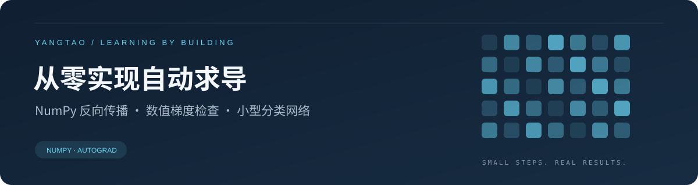
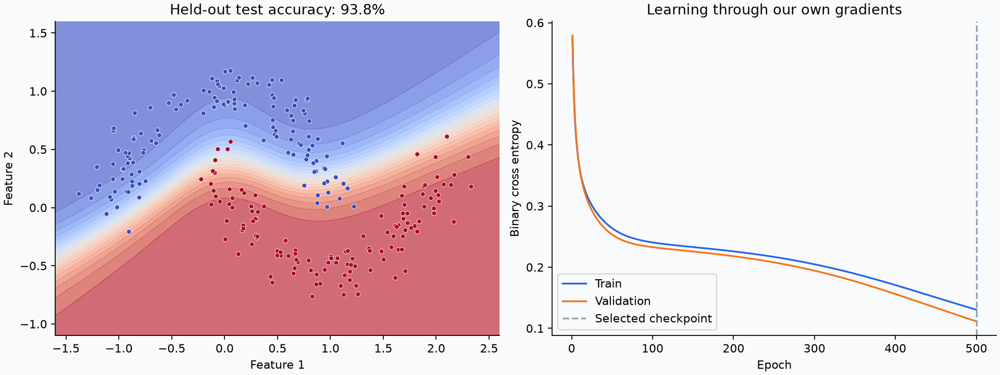

<p align="center"></p>

<p align="center">
  <a href="https://github.com/Yangtao666China/autograd-from-scratch/actions/workflows/tests.yml"></a>
  
  
  <a href="LICENSE"></a>
</p>

<h1 align="center">从零实现自动求导与反向传播</h1>
<p align="center">A small, readable reverse-mode autodiff engine built on NumPy.</p>

实现一个支持广播、矩阵乘法和反向传播的 Tensor，再用它训练双月形数据分类器。没有调用 PyTorch 的自动求导，也不用下载数据集。适合把“反向传播公式”与“训练代码”连接起来。

## 先看结果



| 本仓库默认运行 | 结果 |
|---|---:|
| 可训练参数 | 697 |
| 训练 / 验证 / 测试样本 | 256 / 128 / 256 |
| 验证集选中的轮次 | 500 / 500 |
| 独立测试集准确率 | **93.75%** |
| 独立测试集 BCE | 0.148350 |

以上来自 `seed=42` 的实际运行；原始记录见 [history.csv](artifacts/history.csv) 和 [metrics.json](artifacts/metrics.json)。这是合成数据上的单次教学实验，不代表真实任务或多随机种子的平均表现。训练过程只用验证损失选 checkpoint，最后评估一次测试集。

## 2 分钟运行

需要 Python 3.10 或更高版本。在仓库目录执行：

```bash
python -m venv .venv
# Windows: .venv\Scripts\activate
# macOS / Linux: source .venv/bin/activate
python -m pip install -e ".[demo]"
python -m tiny_autograd.demo
python -m unittest discover -s tests -v
```

输出位于 `artifacts/`：训练曲线、每轮 CSV、指标 JSON 和 NumPy 模型参数。更改输出目录可保留不同实验：

```bash
python -m tiny_autograd.demo --seed 7 --epochs 800 --output outputs/seed7
```

## 从一个梯度开始

```python
from tiny_autograd import Tensor

x = Tensor(3.0, requires_grad=True)
y = x * x + 2 * x
y.backward()
print(x.grad)  # 8.0 = 2*x + 2
```

同一个节点被多次使用时，梯度必须相加。广播产生的梯度还必须沿扩展维度求和，才能恢复参数原来的形状。

```python
import numpy as np
from tiny_autograd import Tensor

x = Tensor([[1., 2.], [3., 4.]])
w = Tensor(np.ones((2, 1)), requires_grad=True)
b = Tensor([[0.]], requires_grad=True)
loss = ((x @ w + b) ** 2).mean()
loss.backward()
print(w.grad, b.grad)
```

## 阅读路径

| 文件 | 看什么 |
|---|---|
| [tensor.py](tiny_autograd/tensor.py) | 运算建图、广播梯度还原、迭代拓扑遍历 |
| [demo.py](tiny_autograd/demo.py) | 数据划分、MLP、稳定 BCE、SGD、验证集选模型 |
| [test_tensor.py](tests/test_tensor.py) | 用中心差分独立检查解析梯度 |
| [设计笔记](docs/design.md) | 梯度累加、数值稳定与简化边界 |

## 已实现 / 边界

- 加减乘除、常数幂、二维矩阵乘法、NumPy 广播。
- `sum` / `mean`、`tanh` / `relu` / `exp` / `log` / 稳定 `softplus`。
- 非标量输出可指定上游梯度；叶子梯度累加，`zero_grad()` 手动清零。
- 14 项测试，覆盖广播、共享节点、重复 backward、2000 层计算图和极端 logits。

这是学习用引擎：只支持 CPU / float64，矩阵乘法仅支持二维；不实现高阶求导、GPU、切片求导或原地运算版本检查。**前向与反向之间不要改写 `Tensor.data`。** `model.npz` 保存参数数组，不是通用模型部署格式。

## 可以继续做的实验

1. 把隐藏层从 24 改成 4：观察决策边界和验证损失。
2. 把学习率从 0.12 改为 0.01 或 1.0：区分学得慢和训练不稳定。
3. 用多个种子重复训练，报告均值与波动。
4. 将 `artifacts/history.csv` 交给 [TrainLens](https://github.com/Yangtao666China/training-log-visualizer) 与其他实验比较。

## 参考与开发说明

- [NumPy broadcasting](https://numpy.org/doc/stable/user/basics.broadcasting.html)
- [PyTorch autograd mechanics](https://docs.pytorch.org/docs/stable/notes/autograd.html)
- [Karpathy / micrograd](https://github.com/karpathy/micrograd)：小型自动求导项目的学习参考；本实现采用 NumPy 张量和广播。

本项目由 AI 辅助编写，附有可复现示例与数值测试；用于学习与继续改进，不声称是原创自动求导算法。欢迎通过 Issue 提供最小复现案例。MIT License。
